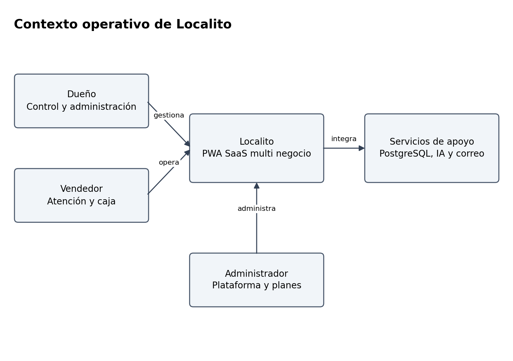
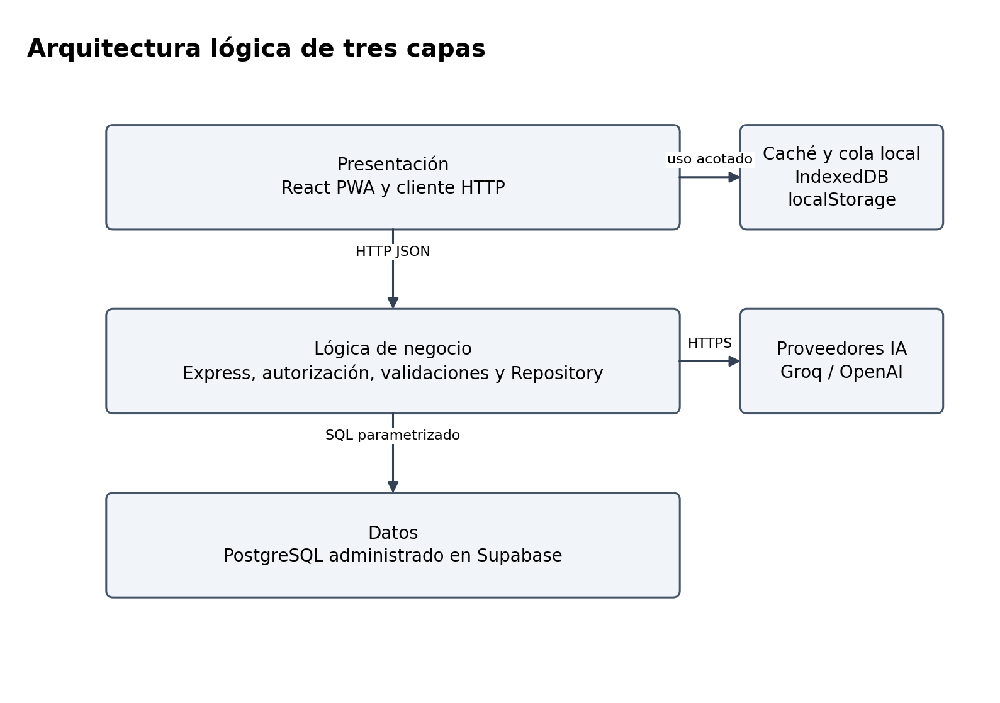
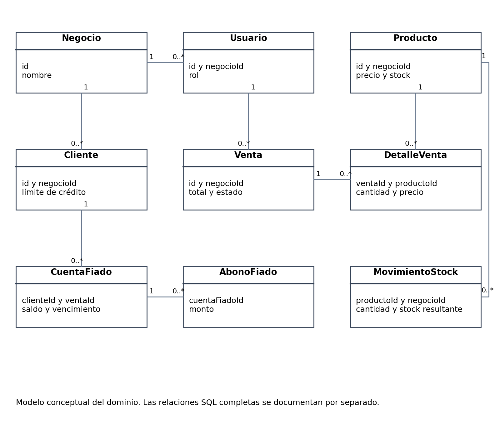
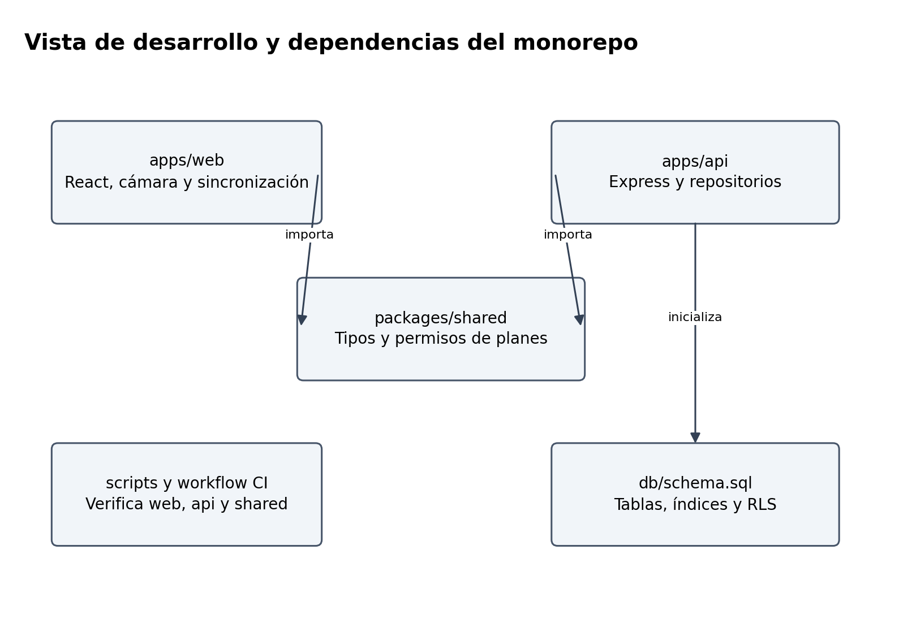
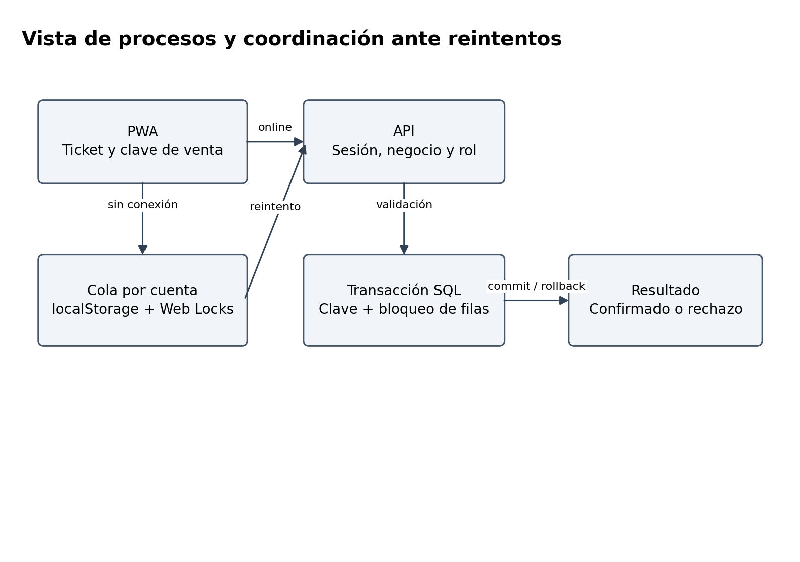
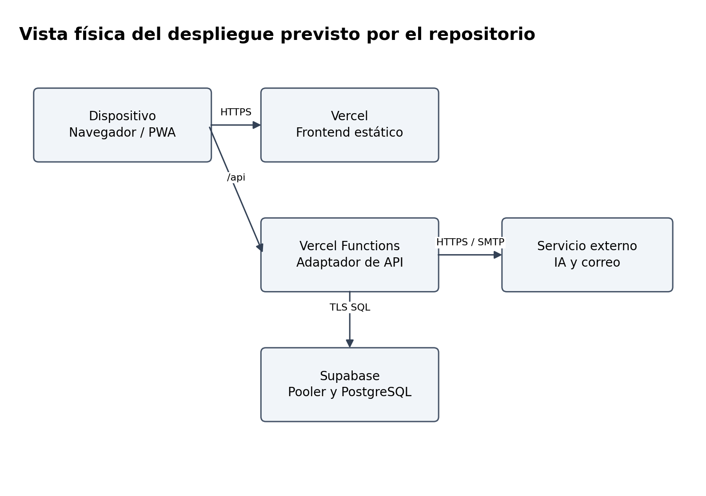
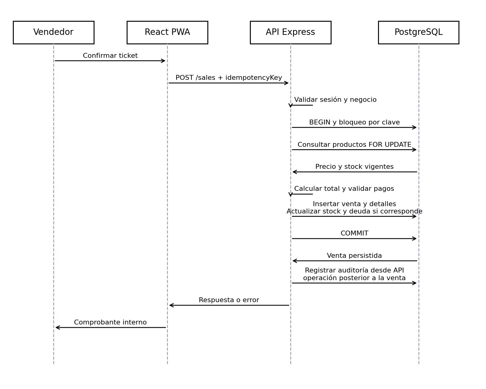

# Arquitectura de software de Localito

# Resumen ejecutivo

Localito utiliza una arquitectura lógica de tres capas para una PWA SaaS que reúne ventas, inventario, clientes, fiado, compras, caja y reportes. La presentación se implementa en React y TypeScript; la API Express concentra autenticación, permisos y reglas; PostgreSQL conserva los registros operacionales. Supabase administra la base y Vercel es el destino de despliegue descrito por el repositorio. Este documento analiza el código del commit ddb9956cf35cfb2035f62528299fd6bb2c9b7d5c, con corte al 03 de octubre de 2026. No acredita una prueba de carga ni una auditoría de producción.

La descripción incorpora las vistas lógica, de desarrollo, de procesos y física, además de escenarios que permiten comprobar su coherencia. Las tres capas explican la separación de responsabilidades; las vistas 4+1 explican el mismo sistema desde preguntas distintas. Se documentan la transacción de venta, la idempotencia, el aislamiento por negocio, la operación offline acotada y la integración de visión. Las decisiones incluyen sus consecuencias y los puntos que necesitan validación adicional.

# Introducción y alcance

El comercio requiere que una venta, su efecto sobre existencias y la deuda de un cliente sean consistentes. Una interfaz atractiva no resuelve por sí sola esa necesidad: el servidor debe validar la identidad, obtener precios vigentes, controlar stock y confirmar la persistencia. Por eso la arquitectura de Localito se evalúa siguiendo una operación completa, desde el ticket del vendedor hasta el registro PostgreSQL y la respuesta que recibe el navegador.

El análisis cubre los archivos apps/web, apps/api, packages/shared, db/schema.sql, docker-compose.yml y vercel.json. Se complementa con las guías de operación y calidad del repositorio. Los diagramas son elaboraciones propias a partir de esos archivos. Cuando describen la infraestructura administrada, representan el diseño configurado y documentado, sin inventar servidores, réplicas, regiones ni acuerdos de disponibilidad.

Como referencias de organización se utilizan el modelo de Kruchten (Kruchten, 1995), la distinción entre capas y niveles de Microsoft (Microsoft, s. f.) y las secciones de arc42 (arc42, s. f.c). ISO/IEC/IEEE 42010 orienta la descripción de arquitectura, pero esta entrega no declara conformidad certificada con la norma (ISO et al., 2022). La información específica de Localito proviene de su implementación (Equipo Localito, 2026).

# Problema arquitectónico y objetivos de calidad

La solución debe atender a negocios independientes sin mezclar sus registros. Además, el vendedor puede operar con conexión inestable y volver a enviar una venta cuya primera respuesta se perdió. Si ese reintento se procesa como una nueva operación, se duplica la venta y se descuenta stock dos veces. El diseño necesita separar una solicitud repetida de una venta nueva, y distinguir un ticket guardado localmente de una venta confirmada en el servidor.

Otro problema aparece al reconocer productos con IA. La respuesta del proveedor puede contener productos inexistentes, cantidades incorrectas o información incompleta. El sistema no debe convertir esa respuesta directamente en cambios de inventario. La sugerencia requiere normalización, asociación con el catálogo y revisión del usuario antes de ejecutar reglas deterministas en el backend.

| Objetivo | Mecanismo observado | Evidencia pendiente |
| --- | --- | --- |
| Integridad de ventas | Transacción, validación y bloqueo de productos | Concurrencia real contra PostgreSQL |
| Aislamiento por negocio | tenantId derivado de sesión y filtros SQL | Pruebas de acceso cruzado en despliegue |
| Evitar duplicados | Clave por negocio, índice único y bloqueo asesor | Reintentos simultáneos con pérdida de respuesta |
| Uso ante cortes de red | Cola de ventas por cuenta y snapshots | Dispositivos físicos y recuperación de errores |
| Mantenibilidad | Workspaces y contrato Repository | Separar archivos con exceso de responsabilidades |
| Operación verificable | Health, CI y documentación de incidentes | Restauración, monitoreo y smoke tests productivos |

# Contexto y límites del sistema

El dueño administra el catálogo y consulta información del negocio. El vendedor atiende clientes con los permisos de su rol. El administrador de plataforma controla negocios y suscripciones. El cliente del comercio participa en la transacción comercial, pero no es necesariamente un usuario autenticado de la PWA. Esta distinción evita dibujar accesos al sistema que no están implementados.

*Contexto de actores y servicios de Localito. Elaboración propia a partir del código.*

La API se relaciona con PostgreSQL y con proveedores de visión y correo. Las terminales bancarias y aplicaciones externas de pago pertenecen a procesos ajenos a Localito: el operador verifica el pago fuera de la aplicación. Los flujos de suscripción con pasarelas presentes en el MVP se describen como simulaciones académicas. No se atribuyen a la arquitectura una integración tributaria SII, un cobro automático real o una conexión directa con máquinas POS.

El alcance offline también tiene límites: permite conservar solicitudes de venta para sincronizarlas y consultar snapshots disponibles. No convierte todos los módulos en operaciones offline y no ofrece sincronización general de compras, usuarios o cambios administrativos. La IA depende de un servicio remoto y de conectividad; la alternativa operativa es búsqueda manual o código de barras.

# Arquitectura de tres capas

La separación entre presentación, lógica y datos permite mantener la decisión comercial en el servidor y tratar el navegador como un cliente que propone acciones. Las capas son responsabilidades lógicas; no significan que existan exactamente tres máquinas físicas. Microsoft distingue ambos conceptos (Microsoft, s. f.). En Localito la API puede ejecutarse localmente como un proceso Node o mediante el adaptador serverless de Vercel, conservando esas responsabilidades.

*Separación de responsabilidades y servicios auxiliares. Elaboración propia a partir del código.*

## Capa de presentación

apps/web contiene componentes React, vistas, formularios, procesamiento de imágenes y el cliente HTTP. La interfaz arma el ticket, muestra precios y permite seleccionar el medio de pago. Los componentes de Venta Rápida y factura presentan propuestas editables. El usuario puede corregir o retirar líneas antes de confirmar. La interfaz facilita el trabajo, pero sus cálculos y controles no sustituyen las validaciones del backend.

IndexedDB se utiliza en workspaceCache.ts para snapshots del entorno de trabajo. offline.ts mantiene la cola de ventas en localStorage y usa Web Locks para coordinar operaciones entre pestañas. El almacenamiento local pertenece al navegador, origen y cuenta: cambiar de dominio o limpiar datos puede impedir recuperar una cola. Esta responsabilidad exige mensajes claros y exportación de pendientes antes de una intervención técnica.

## Capa de lógica de negocio

apps/api/src/server.ts declara endpoints, aplica middleware y valida roles. tenantIdFromRequest obtiene el negocio del usuario autenticado. El token se recibe como Bearer y se resuelve mediante el repositorio de sesiones; auth.ts utiliza scrypt para contraseñas y hash SHA-256 para tokens persistidos. Se observa un mecanismo de sesión firmada para un modo de memoria serverless, pero la configuración vigente exige persistencia en producción. No corresponde describir Supabase Auth como la autenticación real de este código.

Los módulos saleValidation.ts, invoiceImport.ts y visionProvider.ts separan algunas reglas y adaptadores. repository.ts mantiene contratos y dos implementaciones: MemoryRepository y PostgresRepository. La organización permite probar lógica sin levantar una base, aunque repository.ts y server.ts concentran una cantidad considerable de funciones. La separación en capas existe; una modularización más estricta por dominio queda como mejora de mantenibilidad.

## Capa de datos

PostgreSQL almacena negocios, usuarios, ventas y sus detalles, movimientos de stock, fiados, compras y caja. db/schema.sql define tablas, modificaciones compatibles, índices y activación de RLS. El cliente pg del backend ejecuta SQL parametrizado. La PWA no recibe DATABASE_URL ni ejecuta SQL directamente.

RLS está activado en el esquema, pero eso no demuestra por sí solo políticas por usuario ni aislamiento de una conexión privilegiada. Las operaciones del backend siguen necesitando filtros por negocio y verificaciones de pertenencia. La guía de Supabase explica el alcance de la seguridad por filas (Supabase, s. f.b). La revisión de permisos reales y políticas del proyecto desplegado es una comprobación pendiente, no una propiedad certificada de este documento.

# Vistas de arquitectura cuatro más uno

Kruchten organiza la descripción mediante cuatro perspectivas y escenarios que las relacionan (Kruchten, 1995). Localito adopta esa organización para permitir que el evaluador diferencie dominio, código, ejecución y despliegue. Un diagrama de componentes no reemplaza la explicación de concurrencia; un diagrama de despliegue no reemplaza el modelo de datos.

| Vista | Pregunta que resuelve | Representación de Localito |
| --- | --- | --- |
| Lógica | Qué conceptos y servicios forman la solución | Negocio, usuario, venta, producto, caja y fiado |
| Desarrollo | Cómo se organiza y construye el código | apps/web, apps/api, packages/shared y scripts |
| Procesos | Cómo interactúan operaciones concurrentes | Solicitudes, transacciones, locks y sincronización |
| Física | Dónde se ejecutan los elementos | Navegador, Vercel, pooler y PostgreSQL |
| Escenarios | Cómo se comprueba el conjunto | Venta, reintento, IA, fiado y aislamiento |

## Vista lógica

Negocio es el límite organizacional principal. Usuario pertenece a un negocio y tiene un rol. Producto conserva información comercial y existencias. Venta agrupa líneas con cantidad y precio aplicado; una misma venta puede tener pagos divididos o una porción fiada. Cliente y CuentaFiado permiten representar saldo pendiente sin confundirlo con el total vendido. SesionCaja identifica un turno; MovimientoCaja representa ingresos, retiros y gastos asociados.

*Modelo conceptual de las entidades operacionales. Elaboración propia a partir del código.*

El diagrama muestra entidades de dominio, no clases TypeScript obligatoriamente instanciadas con métodos. Los contratos reales también se expresan como tipos e interfaces en packages/shared. Esta distinción es importante: la representación UML organiza conceptos y relaciones sin afirmar que el sistema implementa un modelo orientado a objetos con una clase por tabla. El diccionario SQL completo pertenece al documento Modelo de Datos.

La consistencia exige que todos los productos de una venta y su cliente pertenezcan al mismo negocio autenticado. Algunas tablas hijas, como detalle_ventas, no repiten negocio_id; dependen de la relación con la cabecera. Por eso una consulta o modificación sobre detalles debe comprobar la pertenencia mediante su venta, y no confiar únicamente en un identificador que llega del navegador.

## Vista de desarrollo

El monorepo npm define workspaces apps/* y packages/*. web y api importan @localito/shared; el paquete compartido no constituye un servicio desplegado independiente. Su función es reducir diferencias entre los tipos que consume la presentación y los que acepta la API. La compilación comienza por shared y continúa con api y web según los scripts de la raíz.

*Paquetes y dependencias de construcción. Elaboración propia a partir del código.*

La implementación utiliza React 18.3, TypeScript 5.6 y Vite 5 en el frontend, Express 4 y pg en el backend. Estos números son los declarados por package.json, con rangos donde corresponde; la instalación efectiva depende del lockfile. La documentación recomienda npm ci para una instalación reproducible. No se afirma una actualización de dependencias a versiones actuales porque esta tarea documenta el proyecto, sin modificar su stack.

La dependencia de persistencia se concentra en Repository. MemoryRepository es útil para demostraciones y pruebas locales, pero no representa durabilidad. PostgresRepository ejecuta consultas y transacciones. Una siguiente evolución puede dividir repositorios por ventas, inventario y caja y separar rutas de servicios de aplicación. Esa alternativa debe conservar los contratos, el aislamiento y los casos de prueba existentes.

## Vista de procesos

El navegador envía solicitudes HTTP; Express valida la sesión y el rol antes de invocar el repositorio. En una venta PostgreSQL se utilizan transacciones y bloqueos sobre productos. Un bloqueo asesor transaccional combina negocio y clave de idempotencia, y la búsqueda de una venta previa evita repetir una solicitud ya procesada. El índice único parcial refuerza la regla en la base. La documentación de PostgreSQL permite fundamentar el uso de transacciones y bloqueos (PostgreSQL Global Development Group, s. f.d; PostgreSQL Global Development Group, s. f.b).

*Procesamiento de ventas y sincronización local. Elaboración propia a partir del código.*

Las solicitudes concurrentes no se resuelven solamente porque Node utiliza un event loop. La espera de SQL permite que distintas peticiones avancen, por lo que PostgreSQL debe coordinar acceso a filas y claves. Si dos ventas solicitan la última unidad, la prueba necesaria debe comprobar cuál confirma y cuál rechaza, y revisar stock y movimientos finales. La presencia de FOR UPDATE acredita el mecanismo en el código, no el resultado de una prueba de carga real.

La cola local usa una clave de almacenamiento formada por negocio y usuario. syncQueue detiene el ciclo cuando cambia la sesión y clasifica rechazos 400, 404, 409, 413 y 422 para conservarlos sin bloquear indefinidamente otras ventas válidas. Los errores de red o de autorización detienen el procesamiento. Web Locks evita que dos pestañas manipulen la misma cola simultáneamente; la compatibilidad física de los navegadores debe verificarse por separado.

## Vista física

En desarrollo, la PWA se sirve con Vite en el puerto 5173, la API escucha en 3000 y PostgreSQL se publica en 5432 mediante Docker Compose. El contenedor usa postgres:16-alpine y un volumen nombrado. API y frontend se ejecutan fuera del contenedor en la configuración vigente. No existe evidencia de un Dockerfile que contenga toda la aplicación en esta entrega.

*Despliegue administrado descrito por la configuración. Elaboración propia a partir del código.*

En el despliegue documentado, Vercel sirve archivos estáticos y funciones para la API; vercel.json reescribe rutas /api. Supabase proporciona PostgreSQL y su pooler. repository.ts limita el pool local a una conexión por instancia cuando VERCEL vale 1. Eso evita describir una única conexión global: pueden existir varias instancias de función y cada una tener su pool. La configuración total debe respetar los límites de conexiones del proyecto (Supabase, s. f.a).

La conexión Supabase utiliza TLS con rejectUnauthorized:false en el código auditado. Esto cifra la comunicación, pero relaja la validación del certificado; por tanto, no se documenta como verificación TLS estricta. Debe evaluarse una configuración compatible con validación de certificados. El documento tampoco atribuye una región, réplica, WAF, failover o respaldo probado que no haya sido confirmado.

## Vista de escenarios

El escenario central es registrar una venta online. El vendedor confirma el ticket, el navegador envía POST /sales, la API deriva negocio y rol, y el repositorio bloquea las filas necesarias. Los precios se obtienen del catálogo vigente; el total se calcula en el servidor. La transacción persiste venta, detalles y efectos de stock y fiado. El endpoint registra auditoría después de la operación del repositorio.

*Secuencia de venta según los endpoints y el repositorio. Elaboración propia a partir del código.*

La auditoría desde el endpoint es una operación posterior a la transacción de venta. No se representa como parte de una transacción global que también incluya todos los eventos de caja. Si falla una operación posterior al commit, el cliente puede recibir una respuesta ambigua aunque la venta ya exista. La recuperación debe consultar el estado y reutilizar la misma clave, evitando un nuevo cobro externo.

El segundo escenario es un reintento después de perder la respuesta. Debe devolver la venta previa para la misma combinación de negocio y clave, sin nuevos detalles ni descuentos de stock. El tercero es una venta offline: guardar localmente no prueba aceptación en PostgreSQL, y el servidor aplica catálogo y reglas vigentes al sincronizar. El cuarto es IA: una propuesta solo se transforma en una operación después de revisión humana. El quinto es aislamiento: un identificador válido de otro negocio no debe permitir leer o modificar sus datos.

# Decisiones arquitectónicas y alternativas

El formato de decisiones registra contexto, selección y consecuencias, siguiendo la orientación de arc42 (arc42, s. f.a). Los registros siguientes reconstruyen decisiones observables en el código; no inventan actas ni aprobación formal del equipo. Las recomendaciones nuevas se identifican expresamente como propuestas.

## ADR A01 Separación lógica de tres capas

Estado observado. Presentación, API y datos tienen responsabilidades diferenciadas. Se conserva una API propia porque debe validar ventas, permisos y reglas que afectan varias tablas. La alternativa de permitir escrituras directas del navegador a la base requeriría trasladar esas reglas a políticas y funciones, además de revisar cuidadosamente la exposición de datos.

Consecuencias. La solución puede cambiar componentes de interfaz sin duplicar reglas críticas; también requiere mantener contratos HTTP y desplegar el backend. La división de carpetas no garantiza por sí sola bajo acoplamiento: los archivos grandes y la mezcla de rutas con orquestación deben tratarse como deuda técnica.

## ADR A02 Persistencia PostgreSQL en producción

Estado observado. createRepository exige una conexión persistente cuando NODE_ENV es production o VERCEL es 1. En desarrollo puede usar memoria si falta la conexión. La decisión evita que un despliegue parezca funcionar y pierda operaciones al reiniciar. La alternativa de memoria permanente no satisface la conservación de ventas.

Consecuencias. Una falla de base debe ser visible y puede impedir operaciones. Se necesitan procedimientos de conexión, inicialización, respaldo y recuperación. Que health responda storage:postgres acredita el modo seleccionado, pero no verifica automáticamente login, una venta integral o restauración.

## ADR A03 Idempotencia de ventas

Estado observado. La venta acepta idempotencyKey; PostgreSQL utiliza un índice único por negocio y la operación toma un bloqueo asesor transaccional. La alternativa de bloquear solo el botón del navegador no evita reintentos ni dos pestañas. La alternativa de permitir duplicados y corregirlos manualmente deteriora stock y caja.

Consecuencias. El cliente debe conservar la clave original hasta resolver el estado. Se necesita probar tanto repetición secuencial como concurrencia y cambios de payload asociados a una clave reutilizada. El control de idempotencia no sustituye autorización ni validación de pagos.

## ADR A04 IA como apoyo sujeto a revisión

Estado observado. La API consume visión mediante un adaptador de proveedores y normaliza propuestas contra el catálogo. El usuario revisa antes de confirmar. Se rechaza como opción de diseño una IA que ejecute directamente una venta o cambie stock sin pasar por reglas de negocio.

Consecuencias. La precisión visual sigue dependiendo de imágenes, productos y proveedor. El ahorro de tiempo debe medirse; no se declara una tasa de acierto ni una reducción de minutos sin pruebas. Los identificadores de modelos en .env.example son configuración del repositorio y deben comprobarse con el proveedor antes de desplegar.

## ADR A05 Operación offline limitada a ventas

Estado observado. La cola se conserva por cuenta y origen, mientras IndexedDB mantiene snapshots. La solución evita intentar resolver sincronización general de entidades dentro del MVP. La alternativa de edición offline completa agregaría conflictos de catálogo, permisos y cambios concurrentes que el código actual no resuelve.

Consecuencias. El usuario debe distinguir pendiente, rechazado y sincronizado. No debe eliminar almacenamiento para reparar un rechazo. La conciliación de caja requiere revisar pendientes en todas las cuentas y dispositivos del turno, porque la interfaz no acredita visibilidad global de todas las colas.

# Análisis de seguridad y deuda técnica

Se observan consultas parametrizadas, contraseñas derivadas con scrypt, sesiones con hash y validación de roles. Helmet y CORS están configurados en Express. Estos controles deben relacionarse con casos negativos: ausencia de token, rol insuficiente, sesión revocada, producto de otro negocio y payload inválido. Las buenas prácticas de Express y OWASP sirven como criterios de revisión, sin convertir su mención en una certificación (Express, s. f.; OWASP, s. f.).

Las prioridades pendientes incluyen verificación de políticas y privilegios PostgreSQL, validación estricta de TLS, límites de consumo compartidos entre instancias, revisión del almacenamiento del token en el navegador y concurrencia en cierres de caja. Los mapas de límites en memoria de server.ts pertenecen a cada proceso y no constituyen un contador distribuido global. Las imágenes inline pueden aumentar catálogo, payload y respaldos; evaluar almacenamiento de objetos requiere una decisión futura, no una capacidad ya implementada.

# Validación de la arquitectura

La revisión estática verificó responsabilidades, archivos, endpoints y mecanismos SQL. Se contrastaron manifest, variables, pool, sesiones y cola local. Para acreditar el comportamiento operacional se proponen pruebas integrales con base separada: dos ventas concurrentes, reintento idempotente, rechazo sin efectos parciales, aislamiento entre dos negocios, devolución parcial seguida de anulación y cierre de caja con pendientes en distintos dispositivos.

Cada resultado debe registrar commit, ambiente, datos iniciales, solicitudes, estado final y evidencia. Una prueba con MemoryRepository no sustituye una prueba PostgreSQL; una compilación no sustituye una revisión de permisos. La revisión 4+1 se completa al comprobar que el escenario utiliza los mismos módulos y entidades que las vistas de desarrollo y lógica, y que su despliegue coincide con la configuración real.

# Relación entre vistas requisitos y evidencia

La Matriz de Trazabilidad relaciona los 34 requisitos funcionales con historias, módulos, casos de prueba y evidencias. Para interpretar las vistas 4+1 se parte de una pregunta de verificación: qué responsabilidad conserva cada capa, dónde se encuentra su implementación, cómo interactúa durante una operación y en qué entorno se ejecuta.

| Vista | Relación con requisitos | Evidencia al 04 de octubre |
| --- | --- | --- |
| Lógica | RF-04, RF-07, RF-08 y RF-11; negocio, venta, producto y deuda | HTTP03 y HTTP04 verifican aislamiento en memoria; HTTP07 y HTTP09 verifican efectos de venta |
| Desarrollo | NRF-07 y NRF-14; monorepo y contratos compartidos | Análisis de tipos y compilación de shared, API y web completados |
| Procesos | RNF08 y RNF09; atomicidad e idempotencia | HTTP08 verifica reintento secuencial; bloqueo y concurrencia SQL pendientes |
| Física | RF-34 y RNF03; almacenamiento persistente | Configuración inspeccionada; la campaña HTTP ejecutada usa memoria local |
| Escenarios | Venta, fiado, aislamiento y sesión | HTTP01 a HTTP12; las pantallas y dispositivos requieren su campaña específica |

## Contratos y límites de consistencia

La capa de presentación envía identificadores y cantidades; la API establece identidad y negocio, valida la forma de la solicitud y aplica permisos. El repositorio obtiene precios y registra efectos. El contrato HTTP observado devuelve 201 al crear venta, 200 al registrar un abono y 204 sin cuerpo al cerrar sesión. El cliente debe admitir respuestas sin JSON y conservar la clave de venta durante un reintento. Los casos HTTP registran estados y efectos sobre datos.

Una escritura de venta puede confirmarse antes de que termine el registro de auditoría del endpoint. La recuperación de una respuesta ambigua debe consultar la operación ya creada. El diseño futuro puede evaluar una bandeja transaccional de eventos si exige que el evento y la venta tengan confirmación conjunta; esa mejora no forma parte de la implementación verificada.

## Evaluación de deuda técnica

App.tsx, server.ts y repository.ts concentran responsabilidades amplias. La separación por capas existe, pero el tamaño de esos archivos dificulta cambios y revisiones. Se propone extraer servicios de aplicación por dominio manteniendo los contratos, con las pruebas actuales como protección frente a regresiones. La mejora no exige microservicios: el tamaño del equipo, el semestre y la necesidad de transacciones justifican conservar un despliegue sencillo.

La aceptación arquitectónica requiere cerrar escenarios de PostgreSQL real, restauración y sincronización en navegador. Las pruebas en memoria y con dobles de servicios permiten comprobar reglas delimitadas; no verifican latencia, bloqueo SQL, políticas del proveedor ni capacidad de producción.

# Conclusiones

La arquitectura de tres capas es coherente con el objetivo de conservar reglas críticas en el backend y datos persistentes en PostgreSQL. Las vistas 4+1 muestran aspectos que un único esquema general omitía: límites de dominio, dependencias del monorepo, coordinación de ventas y distribución física. La idempotencia, la transacción y la revisión humana de IA responden a riesgos concretos del comercio.

La defensa debe explicar también las condiciones de operación: offline parcial, pagos externos manuales, autenticación propia y pruebas productivas pendientes. La madurez del proyecto se demuestra relacionando diseño, código y evidencia, y señalando con precisión qué falta validar. Este documento establece esa base sin atribuir al MVP integraciones o garantías que no se han probado.

# Referencias

La evidencia del proyecto corresponde a la revisión versionada del repositorio (Equipo Localito, 2026). Las normas se consultaron mediante sus resúmenes públicos; no se declara certificación. Las fuentes web fueron consultadas durante esta revisión, del 03 al 04 de octubre de 2026.

arc42 (s. f.a). *Architecture decisions*. https://docs.arc42.org/section-9/

arc42 (s. f.c). *Template overview*. https://arc42.org/overview/

Equipo Localito (2026). *LocalitoSaaS [Código y documentación, commit ddb9956cf35cfb2035f62528299fd6bb2c9b7d5c]*. https://github.com/CamiloGonzalezSt/LocalitoSaaS/tree/ddb9956cf35cfb2035f62528299fd6bb2c9b7d5c

Express (s. f.). *Production best practices Security*. https://expressjs.com/en/advanced/best-practice-security/

ISO, IEC e IEEE (2022). *42010 Architecture description resumen público*. https://www.iso.org/standard/74393.html

Kruchten, P. (1995). *Architectural Blueprints The 4 plus 1 View Model of Software Architecture*. https://arxiv.org/abs/2006.04975

Microsoft (s. f.). *N tier architecture style*. https://learn.microsoft.com/en-us/azure/architecture/guide/architecture-styles/n-tier

OWASP (s. f.). *Application Security Verification Standard*. https://owasp.org/www-project-application-security-verification-standard/

PostgreSQL Global Development Group (s. f.b). *PostgreSQL 16 Explicit locking*. https://www.postgresql.org/docs/16/explicit-locking.html

PostgreSQL Global Development Group (s. f.d). *PostgreSQL 16 Transactions*. https://www.postgresql.org/docs/16/tutorial-transactions.html

Supabase (s. f.a). *Connecting to Postgres*. https://supabase.com/docs/guides/database/connecting-to-postgres

Supabase (s. f.b). *Row Level Security*. https://supabase.com/docs/guides/database/postgres/row-level-security

