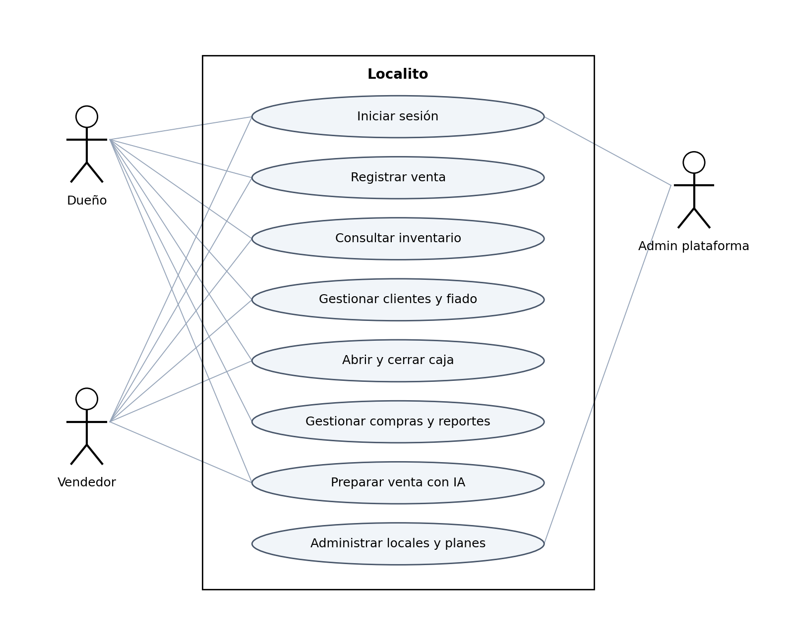

# Diagramas UML de Localito

# Resumen ejecutivo

Este documento contiene diagramas de casos de uso, clases conceptuales, componentes y secuencia de venta. Sus figuras se construyen a partir de actores, paquetes, endpoints y esquema de Localito. El objetivo es explicar responsabilidades y relaciones, acompañando cada diagrama con escenarios y límites de interpretación.

# Introducción y criterios de modelado

UML ofrece notación para representar estructura y comportamiento de sistemas (Object Management Group, 2017). La selección de estos diagramas responde a preguntas concretas: quién usa la solución, qué entidades relaciona, qué componentes colaboran y qué secuencia registra una venta. No se afirma que todos los tipos TypeScript sean clases instanciadas ni que un diagrama conceptual sustituya el SQL.

Los modelos deben ser consistentes con Arquitectura y Modelo de Datos. La venta utiliza POST /sales según server.ts, aunque una fuente PlantUML anterior empleaba /ventas. Esta revisión corrige la representación y conserva la autenticación previa a la operación. La auditoría del endpoint se muestra después de persistir la venta.

# Diagrama de casos de uso

*Actores y capacidades principales de Localito. Elaboración propia a partir del código.*

Dueño, vendedor y administrador de plataforma tienen responsabilidades diferentes. El dueño administra y revisa; el vendedor opera según permisos; el administrador gestiona negocios y planes. La asociación muestra participación, no autoriza automáticamente todos los endpoints de una categoría. Los permisos exactos se deben comprobar contra requireRoles y casos negativos.

Gestionar clientes y fiado agrupa varias operaciones. Deben descomponerse al probar creación, deuda, saldo y abono. La ayuda visual prepara información y no incluye ejecutar una venta de manera autónoma. Los proveedores externos actúan como servicios del backend y no como usuarios del comercio.

# Diagrama de clases conceptuales

*Entidades y cardinalidades del núcleo de ventas y fiado. Elaboración propia a partir del código.*

Negocio relaciona registros de usuarios y operaciones. Venta mantiene sus detalles; Cliente relaciona cuentas fiadas; CuentaFiado relaciona abonos. Producto puede aparecer en varias líneas y movimientos. Las cardinalidades representan relaciones conceptuales uno a muchos y no significan que una venta vacía sea un resultado válido de negocio.

El modelo SQL completo contiene más tablas que la figura y conserva referencias opcionales. El diccionario documenta las condiciones exactas. Este diagrama se limita a un núcleo legible para explicar el escenario principal; compra y caja se desarrollan mediante descripción y tablas en los documentos especializados.

# Diagrama de componentes

*Componentes por capa y dependencias de servicios. Elaboración propia a partir del código.*

React PWA invoca la API mediante HTTP JSON; la API valida identidad, reglas y persistencia. PostgreSQL conserva los datos y la visión externa se invoca desde backend. IndexedDB y localStorage corresponden a usos locales acotados. No existe dependencia inversa de PostgreSQL hacia componentes React.

El paquete shared se utiliza en construcción y tipos, no es una API desplegada. La vista de desarrollo de Arquitectura muestra esa relación. El despliegue serverless no convierte módulos internos en microservicios independientes.

# Diagrama de secuencia de venta

*Secuencia y límites transaccionales de una venta. Elaboración propia a partir del código.*

El usuario confirma, la PWA envía la clave y el servidor valida sesión y negocio. El repositorio inicia transacción, consulta precios y stock bloqueando filas y persiste la operación. El commit confirma la venta; el endpoint registra auditoría por separado y responde. Si se produce un error, la recuperación debe verificar si la venta quedó confirmada antes de generar otro intento.

La figura muestra el caso satisfactorio y deja los alternativos descritos abajo. No agrega una invocación real a Webpay, Mercado Pago o SII. La caja relaciona operaciones y turnos según sus métodos; no se dibuja una actualización universal de cada tabla dentro de createSaleWithClient cuando el código no la realiza.

# Escenarios detallados de uso

## CU01 Inicio de sesión

Actor. Dueño o vendedor.

Precondición. Cuenta de prueba registrada y backend accesible.

Flujo principal. Ingresar credenciales; API verifica contraseña; crea sesión; cliente recibe contexto.

Alternativas. Credencial incorrecta o sesión ausente impide operaciones; no mostrar hash al usuario.

Resultado a comprobar. Sesión y acceso al negocio permitido. La existencia del modelo no acredita ejecución del caso. Se relaciona con el catálogo de pruebas y con el requisito funcional correspondiente.

## CU02 Registrar venta

Actor. Vendedor.

Precondición. Catálogo, productos activos y cuenta autorizada.

Flujo principal. Agregar líneas; revisar ticket; elegir pago; enviar POST /sales; verificar persistencia.

Alternativas. Stock insuficiente o pagos incoherentes deben rechazar sin efecto parcial.

Resultado a comprobar. Venta y stock consistentes. La existencia del modelo no acredita ejecución del caso. Se relaciona con el catálogo de pruebas y con el requisito funcional correspondiente.

## CU03 Registrar venta fiada

Actor. Vendedor según permisos.

Precondición. Cliente activo y condición de crédito válida.

Flujo principal. Elegir cliente; preparar venta; seleccionar crédito o parte fiada; confirmar.

Alternativas. Cliente bloqueado, límite excedido o cliente ajeno se rechaza.

Resultado a comprobar. Cuenta de deuda relacionada a la operación. La existencia del modelo no acredita ejecución del caso. Se relaciona con el catálogo de pruebas y con el requisito funcional correspondiente.

## CU04 Registrar abono

Actor. Usuario autorizado.

Precondición. Cuenta pendiente del negocio.

Flujo principal. Consultar saldo; ingresar monto y método; enviar abono; revisar saldo.

Alternativas. Monto inválido o cuenta ajena no produce un abono.

Resultado a comprobar. Saldo y pago conservados. La existencia del modelo no acredita ejecución del caso. Se relaciona con el catálogo de pruebas y con el requisito funcional correspondiente.

## CU05 Recepcionar compra

Actor. Dueño.

Precondición. Proveedor y orden del negocio.

Flujo principal. Consultar pendientes; ingresar cantidades; validar; confirmar recepción.

Alternativas. Cantidad no autorizada o producto ajeno se rechaza.

Resultado a comprobar. Recepción y stock correspondientes. La existencia del modelo no acredita ejecución del caso. Se relaciona con el catálogo de pruebas y con el requisito funcional correspondiente.

## CU06 Preparar venta con IA

Actor. Vendedor.

Precondición. Catálogo y proveedor configurados con conectividad.

Flujo principal. Tomar imagen; API propone; revisar productos y cantidades; incorporar al ticket.

Alternativas. Proveedor falla o producto ambiguo requiere búsqueda manual.

Resultado a comprobar. Propuesta revisada sin venta automática. La existencia del modelo no acredita ejecución del caso. Se relaciona con el catálogo de pruebas y con el requisito funcional correspondiente.

## CU07 Preparar factura con IA

Actor. Dueño.

Precondición. Imagen de prueba y proveedor remoto configurado.

Flujo principal. Capturar; obtener líneas; revisar costo y cantidades; confirmar por flujo de importación.

Alternativas. Respuesta inválida conserva estado sin recepción automática.

Resultado a comprobar. Datos revisados para operación de mercadería. La existencia del modelo no acredita ejecución del caso. Se relaciona con el catálogo de pruebas y con el requisito funcional correspondiente.

## CU08 Sincronizar venta pendiente

Actor. Vendedor.

Precondición. Cola de la cuenta actual y clave original.

Flujo principal. Restaurar red; enviar pendiente; comprobar venta; retirar entrada aceptada.

Alternativas. Rechazo permanente se conserva; cambio de sesión detiene envío.

Resultado a comprobar. Cola y estado del servidor coherentes. La existencia del modelo no acredita ejecución del caso. Se relaciona con el catálogo de pruebas y con el requisito funcional correspondiente.

## CU09 Cerrar caja

Actor. Usuario autorizado.

Precondición. Sesión abierta y pendientes revisados.

Flujo principal. Consultar esperado; contar efectivo; registrar diferencia y motivo; confirmar.

Alternativas. Falta de motivo cuando hay diferencia o pendientes requiere resolución.

Resultado a comprobar. Sesión cerrada con valores auditables. La existencia del modelo no acredita ejecución del caso. Se relaciona con el catálogo de pruebas y con el requisito funcional correspondiente.

# Verificación de consistencia

Se revisó que los actores correspondan a los roles, que los componentes correspondan a carpetas y servicios y que la secuencia use el endpoint y las reglas reales. Las figuras son elaboración propia. La validación operacional necesita ejecutar los casos y observar datos; la revisión del diagrama no sustituye esas pruebas.

# Evidencias relacionadas con esta versión

El Informe Académico conecta objetivos, método, antecedentes y resultados. La Matriz de Trazabilidad identifica requisitos e historias asociados a la implementación. El Informe de Verificación conserva las ejecuciones del 04 de octubre de 2026 y distingue su alcance local de la aceptación en PostgreSQL y con usuarios. Control de Entrega reúne la cobertura de los 17 artefactos y los pendientes de cierre.

# Conclusiones

Los diagramas complementan las explicaciones de arquitectura y requisitos con representaciones legibles. Su aporte se sostiene en el vínculo con entidades, módulos y operaciones reales, manteniendo explícito el alcance conceptual y el estado de verificación.

# Referencias

La evidencia del proyecto corresponde a la revisión versionada del repositorio (Equipo Localito, 2026). Las normas se consultaron mediante sus resúmenes públicos; no se declara certificación. Las fuentes web fueron consultadas durante esta revisión, del 03 al 04 de octubre de 2026.

Equipo Localito (2026). *LocalitoSaaS [Código y documentación, commit ddb9956cf35cfb2035f62528299fd6bb2c9b7d5c]*. https://github.com/CamiloGonzalezSt/LocalitoSaaS/tree/ddb9956cf35cfb2035f62528299fd6bb2c9b7d5c

Object Management Group (2017). *Unified Modeling Language 2.5.1*. https://www.omg.org/spec/UML/2.5.1/About-UML

